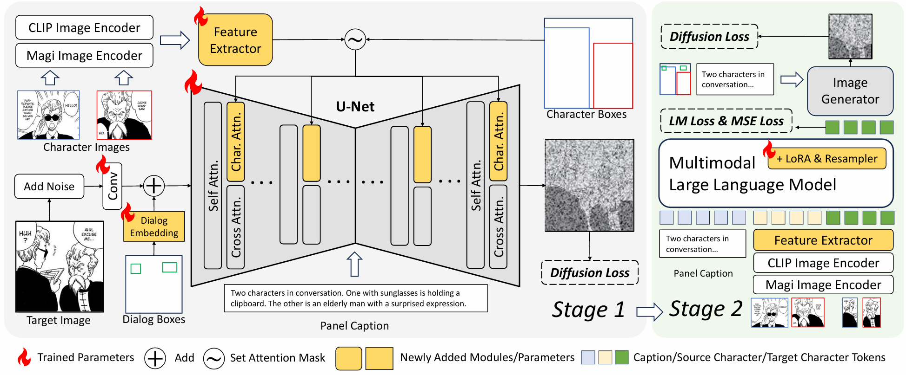

# DiffSensei: Bridging Multi-Modal LLMs and Diffusion Models for Customized Manga Generation

<div align="center">

[](TODO)
[](https://jianzongwu.github.io/projects/diffsensei)
[](https://www.youtube.com/watch?v=TLJ0MYZmoXc&source_ve_path=OTY3MTQ)
[](https://huggingface.co/spaces/jianzongwu/DiffSensei)
[](https://huggingface.co/jianzongwu/DiffSensei)
[](https://huggingface.co/datasets/jianzongwu/MangaZero)


</div>


More demos are in our [project page](https://jianzongwu.github.io/projects/diffsensei).

### A story about LeCun, Hinton, and Benjio winning the Novel Prize...


## 🚀 TL;DR

DiffSensei can generate controllable black-and-white manga panels with flexible character adaptation.



**Key Features:**
- 🌟 Varied-resolution manga panel generation (64-2048 edge size!)
- 🖼️ One input character image, create various appearances
- ✨ Versatile applications: customized manga generation, real human manga creation


## 🎉 News

- [2024-12-10] Checkpoint, dataset, and inference code are released

## 🛠️ Quick Start

### Installation

``` bash
# Create a new environment with Conda
conda create -n diffsensei python=3.11
conda activate diffsensei
# Install Pytorch and Diffusers related packages
conda install pytorch torchvision torchaudio pytorch-cuda=12.1 -c pytorch -c nvidia
conda install -c conda-forge diffusers transformers accelerate
pip3 install -U xformers --index-url https://download.pytorch.org/whl/cu121
# Install other dependencies
pip install -r requirements.txt
# Third-party repo for running the gradio demo
pip install gradio-image-prompter
```

### Model Download

Download our DiffSensei model from [huggingface](https://huggingface.co/jianzongwu/DiffSensei) and place it in the `checkpoints` folder like this:

```
checkpoints
  |- diffsensei
    |- image_generator
      |- ...
    |- mllm
      |- ...
```


### Inference with Gradio

We provide gradio demo for inferencing DiffSensei.

``` bash
CUDA_VISIBLE_DEVICES=0 \
python -m scripts.demo.gradio \
  --config_path configs/model/diffsensei.yaml \
  --inference_config_path configs/inference/diffsensei.yaml \
  --ckpt_path checkpoints/diffsensei
```

Please be patient. Try more prompts, characters, and random seeds, and download your favored manga panels! 🤗

### The MangaZero Dataset

For license issues, we cannot directly share the images. Instead, we provide the manga image urls (in MangaDex) and annotations of our MangaZero dataset.
Note that the released version of MangaZero is about 3/4 of the full dataset used for training. The missing images is because some urls are not available. For similar usage for manga data, we strongly encourage everyone who is interested to collect their dataset freely from MangaDex, following the instruction of [MangaDex API](https://api.mangadex.org/docs/).

Please download MangaZero from [Huggingface](https://huggingface.co/datasets/jianzongwu/MangaZero).

After downloading the annotation file, please place the annotation file in `data/mangazero/annotations.json` and run `scripts/dataset/download_mangazero.py` to download and organize the images.


``` bash
python -m scripts.dataset.download_mangazero \
  --ann_path data/mangazero/annotations.json \
  --output_image_root data/mangazero/images
```

## Citation

```
```


<p align="center">
  <a href="https://star-history.com/#jianzongwu/DiffSensei&Date">
    
  </a>
</p>